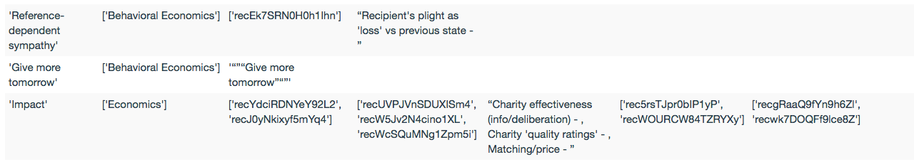
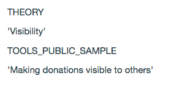

Development
============

This package provides a way to connect Airtable (AT) as a GUI database and DokuWiki (DW) as a content presentation system.
This is done through developing interfaces between particular AT tables and particular DW pages. A number of such interfaces
have been implemented and can be kept up to date via the top-level scripts of this package, i.e., ``main.py`` and
``update_all.py``.

Developing a new interface requires several steps described in detail in this section:

1. Understand package structure.
2. Try out default settings for a new table.
3. Define a new table format in ``tabledef.json``.
4. Define a new table class in ``wikicontents.py``.
5. Define a connection to the new class in ``wikimanager.py``.

Package structure
------------------

This image gives a schematic representation of the 3 scripts included in the package:

.. image:: dw_scheme.png

Defaults
-----------------

The first step in constructing a class for a new table is to display its content using the default formatting included
in the base Table class. For every AT table there is in principle a possibility to push it to DW (1) as a table, such as
`the tools table <http://innovationsinfundraising.org/doku.php?id=tables:tools>`_ or (2) as a set of pages, where each page
is based on information contained in a single row of the AT table. For instance, see
`this page <http://innovationsinfundraising.org/doku.php?id=tools:contingent_match>`_
based on one of the rows in the tools table.

When pushing a new table to DW the default settings will simply put all the information contained in the table in either
the table or a pages format. The former will be published on `IIF tables:test page <http://innovationsinfundraising.org/doku.php?id=tables:test>`_
while the latter on `IIF test:test_page page <http://innovationsinfundraising.org/doku.php?id=test:test_page>`_. Once these test pages are published,
you can see the default formatting and try to understand how it can be improved to achieve a desired look.

As an example, let's imagine we wanted to publish a Theories table as a table and a set of pages, where each page describes
a single theory. We need to run the following::

    python3 main.py official Theories create both

Now, if we go to the 'tables:test' link mentioned above we will see something like the following:

The information that is placed in the table is not ordered, formatted or interpreted by default.

The same principle holds for a default page. It will print a given row as a set of lines in which column names written
in uppercase alternate with the content of those columns. Such as this:

Defining table and page format
-------------------------------

The ugly defaults described in the previous section are caused by the way content is stored in AT tables and fetched by
its API. Namely, all records arrive as a list of records. Every record in that list is a dictionary with 3 keys:

* 'id': unique record id
* 'fields': a dictionary with keys that correspond to column names and values that are whatever is stored in that row in those columns
* 'createdTime': the time the record was created (there is no way to access when it was last modified)

Therefore, assuming we have initialized the Theories table and stored it in a variable 'table', in order to get the
content of, for instance, the 'Theory' column of the first row that got fetched, we would need to execute the
following command::

    theory_name = table.records[0]['fields']['Theory']
    print(theory_name)

If for a given row some column in the table is empty, it is not fetched by the API. For the filled columns, the type of
entity returned depends on the column type in the AT table. For instance, short and long text will be a string,
multiple select -- a list of strings while linked records -- a list of ids for records in a linked table.

In order to turn such raw fetched records into a meaningful presentation on DW, you need to start by creating
format definitions for table and pages in the ``tabledef.json`` file. This file is a dictionary with the following structure::

  "TABLE NAME": {
    "COLUMN NAME": {
      "type": "COLUMN TYPE",
      "table": {"publish": PUBLISH?, "pos": DESIRED POSITION, "header": "TABLE HEADER"},
      "page": {"publish": PUBLISH?, "pos": DESIRED POSITION, "placeholder": "PAGE PLACEHOLDER"}
    },

where TABLE NAME is usually the name of table in the AT. The exception to this is when the same table in the AT serves different
tables on DW. In that case the name should be the one that identifies the correct class for that table in the ``wikicontents.py``.

For instance, a single papers_mass table in AT is presented as
`a descriptive content on DW <http://innovationsinfundraising.org/doku.php?id=papers:papers>`_ as well as
`quantitative meta-analysis content on DW <http://innovationsinfundraising.org/doku.php?id=tables:meta>`_.
These are generated by two separate classes PapersTable and MetaAnalysisTable in ``wikicontents.py`` respectively and are defined as
papers_mass_qualitative and papers_mass_quantitative in the ``tabledef.json``.

Further, COLUMN NAME is mostly the name of the columns in the AT and COLUMN TYPE is the type of the data in that column,
such as "Single line text", "Checkbox", "Multiple select" etc. Since sometimes the content that appears on DW is richer
than data contained in AT columns, there is a number of special COLUMN TYPES that will be described below.

The remainder of information for each column is organized in two dictionaries: "table" and "page" that define the format
for DW tables and pages. For each of these, you need to specify whether the column will be published (choose value from
``true`` or ``false``) and in which position (choose number).
This allows for a flexibility in deciding which content from the AT table will go into a DW table format and which in
the associated pages. For clarity it is advisable to set "pos" to 0 whenever "publish" is set to ``false``. Specifying
the position will ensure that the header and the rows will appear in the same order (and the same for placeholders in a page).

Finally, for "table" you need to specify the TABLE HEADER, which is simply the text that will appear on top of the DW
table for that column (which does not need to be the same as the title of that column in AT). For the "placeholder"
in "page" dictionary, you need to insert the placeholder text that will define where the content from that column will
go whenever it is pushed as a DW page (see below).

As an example, this is a beginning of the definition for the Tools table::

  "Tools": {
    "Tool name": {
      "type": "Single line text",
      "table": {"publish": false, "pos": 0, "header": "Tool name"},
      "page": {"publish": true, "pos": 1, "placeholder": "TOOLNAME"}
    },

We can see that the content of the "Tool name" column will not be published in the DW table but will be published on
the DW page in the first position and will replace the TOOLNAME placeholder.

Now, if the DW table and pages will contain exactly the same information as that present in AT, filling in the tabledef
dictionary with simple column types is sufficient. The script will then take care of formatting everything appropriately.
An example is the effective_charities_rated table whose columns are mostly text and checkboxes. It contains one column
that is of type "Link to another record". Whenever the column is of this type, you need to specify the column name from
the linked table that you want to display in the table. For instance, if some table contains a linked record to the Tools
table, we will probably want to display the name of that tool and therefore need to insert "Tool name" under "linked_column_name".
For effective_charities_rated, this looks like::

    "rated_by": {
      "type": "Link to another record",
      "table": {"publish": false, "pos": 5, "header": "Rater",
      "linked_column_name": "Rater"}
    },

because we want to display the name of the rater which is stored in column called "Rater".

Sometimes the information presented in DW table is a combination of information contained in different columns in AT.
For instance, the descriptive DW representation of the papers_mass table contains a link to paper pages, a link to the
associated tools and a link to paper full text::

  "papers_mass_qualitative": {
    "PaperPage_Parencite": {
      "type": "Internal link",
      "table": {"publish": true, "pos": 1, "header": "Reference",
      "namespace": "papers", "label": "Title", "replacement_label": "parencite"},
      "page": {"publish": false, "pos": 0, "placeholder": "REF",
      "namespace": "papers", "label": "Title", "replacement_label": "parencite"}
    },
    ...
    "tools": {
      "type": "Raw",
      "table": {"publish": true, "pos": 5, "header": "Tools"},
      "page": {"publish": true, "pos": 7, "placeholder": "TOOLS"}
    },
    ...
    "Fulltext_Link": {
      "type": "External link",
      "table": {"publish": true, "pos": 6, "header": "Link",
      "URL": "URL", "label_type": "fixed", "label": "Full text"},
      "page": {"publish": false, "pos": 0, "placeholder": ""}
    },

This is accomplished by three special COLUMN TYPES:

* **Internal link** for constructing a link to DW pages; this requires specifying the namespace under which these pages reside on DW ("namespace"), the name of the column that is used for producing the address of the page ("label") and the name of the column that is used for displaying the link ("replacement_label").
* **External link** for constructing a link to an external page; this requires specifying the name of the column in which the address is contained ("URL"), the type of the text that will be used for displaying the link ("label_type"), i.e. whether the text is always the same ("fixed") or is based on some other column ("field") and then the text that will be displayed ("label"), which is either the fixed text or the name of the column that will be used. In the above example, we are using a "Full text" text for all links to the full text of the paper listed in the table. If we wanted to display the title of the paper instead, we would have to set "label_type" to "field" and "label" to "Title".
* **Raw** for returning the information from AT table without modification; this is required when the operation for processing this information is more involved and will be described in the next section.

Whenever the column type is "Raw", the column name should be an exact match to that column in AT. For internal and external
links, the column name can be anything.

Defining a new class
---------------------

Having defined the format for your table (and possibly pages), you need to define a new class specific for that table in the
``wikicontents.py``.

Class initialization
^^^^^^^^^^^^^^^^^^^^^^^

For simple tables (where the format does not include "Raw" column type, it is sufficient
to define the table initialization function (``def __init__()``):

* ``self.airtable`` creates a connection to the require table in the AT database
* ``self.records`` fetches all the records
* ``self.dw_table_page`` defines the location of the table (formatted as a table) on DW
* ``self.included_in`` defines where the table is actually shown on DW (this is mostly for record-keeping)
* ``self.main_column`` defines the first column to be displayed - the record is not displayed if information in that column is missing
* ``sefl.columndefs`` specifies which table format in ``tabldef.json`` should be applied
* ``self.header`` constructs the table header
* ``self.placeholders`` constructs the page placeholders list
* ``self.linked_pages`` specifies whether the AT table is to be presented also as a set of pages
* ``self.dw_page_template`` if the former condition is true here we define the template for those pages (more below)
* ``self.dw_page_name_column`` defines which column is used to create a page name on DW (and its location)
* ``self.root_namespace`` defines in which namespace the page is included

An example of such a table class for effective_charities_rated is as follows::

    class EffectiveCharities(Table):

        def __init__(self, wiki, base_name, table_name, user_key):
            super(EffectiveCharities, self).__init__(wiki, base_name, table_name, user_key)
            self.airtable = at.Airtable(base_name, table_name, user_key)
            self.records = self.airtable.get_all()
            self.dw_table_page = 'tables:effective_charities'
            self.included_in = 'iifwiki:earatings'
            self.main_column = 'charity_name'
            self.columndefs = self.tabledefs[table_name]
            self.header = self.construct_header(self.columndefs)
            self.linked_pages = False

Construct row function
^^^^^^^^^^^^^^^^^^^^^^^^

In more complex cases cases, you need to redefine the basic function for constructing a row of DW table,
``def construct_row(self, record)``. This will typically first include a call to the ``fetch_row`` function that will get
a row for a particular record. If some columns have been assigned a "Raw" type, you can then process them as required to
compose a final version of the row. For instance, suppose we wanted to concatenate two AT columns into one DW column.
Let's say we want to do it for the Giving_companies table and what we want to concatenate is the company name and its sector.
The table format will then look like this::

  "Giving_companies": {
    "Company": {
      "type": "Raw",
      "table": {"publish": true, "pos": 1, "header": "Company"},
      "page": {"publish": true, "pos": 1, "placeholder": "COMPANY"}
    },
    "Sector": {
      "type": "Raw",
      "table": {"publish": true, "pos": 2, "header": "Sector"},
      "page": {"publish": true, "pos": 2, "placeholder": "SECTOR"}
    },
    ...

While the class will contain the following function::

    def automatic_construct_row(self, record):
        row = self.fetch_row(self.columndefs, record)
        # find the indices of requred variables in the fetched row
        company_pos = self.columndefs['Company']['table']['pos']-1
        sector_pos = self.columndefs['Sector']['table']['pos']-1
        # find the required variables
        company = row[company_pos]
        sector = row[sector_pos]
        # both are strings so we don't need to transform them, just combine
        company_sector = company + ', ' + sector
        # replace the original variables we don't need any more with empty strings
        row[company_pos] = ''
        row[sector_pos] = ''
        # insert the new variable where desired, let's say in the first position
        row.insert(0, company_sector)
        # format the new row and return
        formatted_row = "| " + " | ".join(row) + " |\n"
        return formatted_row

Writing such a function requires some trial and error but once defined will work for all rows.

Another example when a redefinition of ``automatic_construct_row`` is required is when you want to create some custom
popovers or other elements in the table; or when an internal link involves dealing with linked records. That is, the script
can automatically take care of simple linked records (just specify the column type as "Link to another record" as explained
in the previous section). It can also take care of creating internal links to pages within the same table, e.g. a DW
Tools table that contains links to Tools pages (column type will be "Internal link").
However, in order to insert links to papers pages within a Tools table, we would need to create internal links to linked
records. This at present requires manual handling - see the call to ``get_paper_links`` function in ToolsTable.

Set table function
^^^^^^^^^^^^^^^^^^^^^

If you want to display the DW table with a particular number of rows displayed by default, you need to insert the following
function definition in the new class::

    def set_table_page(self):
        new_page = self.format_table(page_length=100)
        self.wiki.pages.set(self.dw_table_page, new_page)

Here the length is set to 100. If the class does not have such a function, the table will have 10 rows displayed by default.

Creating a page
^^^^^^^^^^^^^^^^^^^^^^^^^^^^^^^

The procedure for creating a set of pages based on AT table is composed of several steps:

1. Go to DW and define a page template within the namespace that will collect those pages. Call this page ``pagetemplate``. See an example of a tool page template `here <http://innovationsinfundraising.org/doku.php?id=tools:pagetemplate>`_.

2. Define ``create_page`` function in the table class.

In the first step you can style the template however you like, e.g. adding headings for different sections, changing font etc.
The template however is a "template" because it does not contain any actual values from any particular record. It defines where
those values will be inserted by means of placeholders. These placeholders will be replaced with actual content from different
records, i.e. will be different for every page.

For instance, the tool page template contains a placeholder "TOOLNAME" which for every tool record will contain the tool name.
It also has a header "Main findings" which will appear on every tool page. However, under that heading you can see a placeholder
"FINDINGS" which will be replaced with content drawn from the "Findings summarized" column in the AT Tools table.

The template should be fetched in the class ``__init__`` function like this::

    self.dw_page_template = wiki.pages.get(self.root_namespace + 'pagetemplate')

The ``create_page`` function will then use the template and create a page per table record. At the very minimum
this function should be like this::

   def create_page(self, record):
        # fetch the relevant variables for the page
        variables = self.fetch_row(self.columndefs, record, target_format="page")
        # fetch the placeholders
        keys = self.placeholders
        # construct a list of corresponding pairs (key, variable)
        replacements = tuple(zip(keys, variables))
        # replace placeholders with variables
        page = reduce(lambda a, kv: a.replace(*kv, 1), replacements, self.dw_page_template)
        return page

Naturally, if some further processing needs to happen to the variables used to create each page, it has to be
encoded in the function - see examples of defined classes.

Adding a connection
--------------------

Once a new table class has been implemented, it needs to be added in two places in the ``wikimanager.py``:

* the name of the table should be added to the ``self.defined_tables`` list in manager initialization function

* a connection between the table name and the table class should be added as a following snippet in the ``setup_table`` function::

       elif table_name == 'NAME':
            table_base = 'BASE API KEY'
            self.table = wikicontents.SOMETABLE(self.wiki, table_base, table_name, self.user_key)
            self.used_table_name = table_name

where NAME is the name of the table in the AT database, BASE API KEY is the API key for the base in which that table is contained
and SOMETABLE is the name of the newly defined class.

Modifying an existing class
----------------------------

Consider possible changes you might want to implement:

* to change the order of the columns in the table, simply change the numbers assigned to "table"["pos"]
* to change the table header of a specific column, change the text in "table"["header"]
* to publish a previously hidden column, change the value in "table"["publish"] to true
* to define a new column, add the required information to that table in ``tabledef.json``
