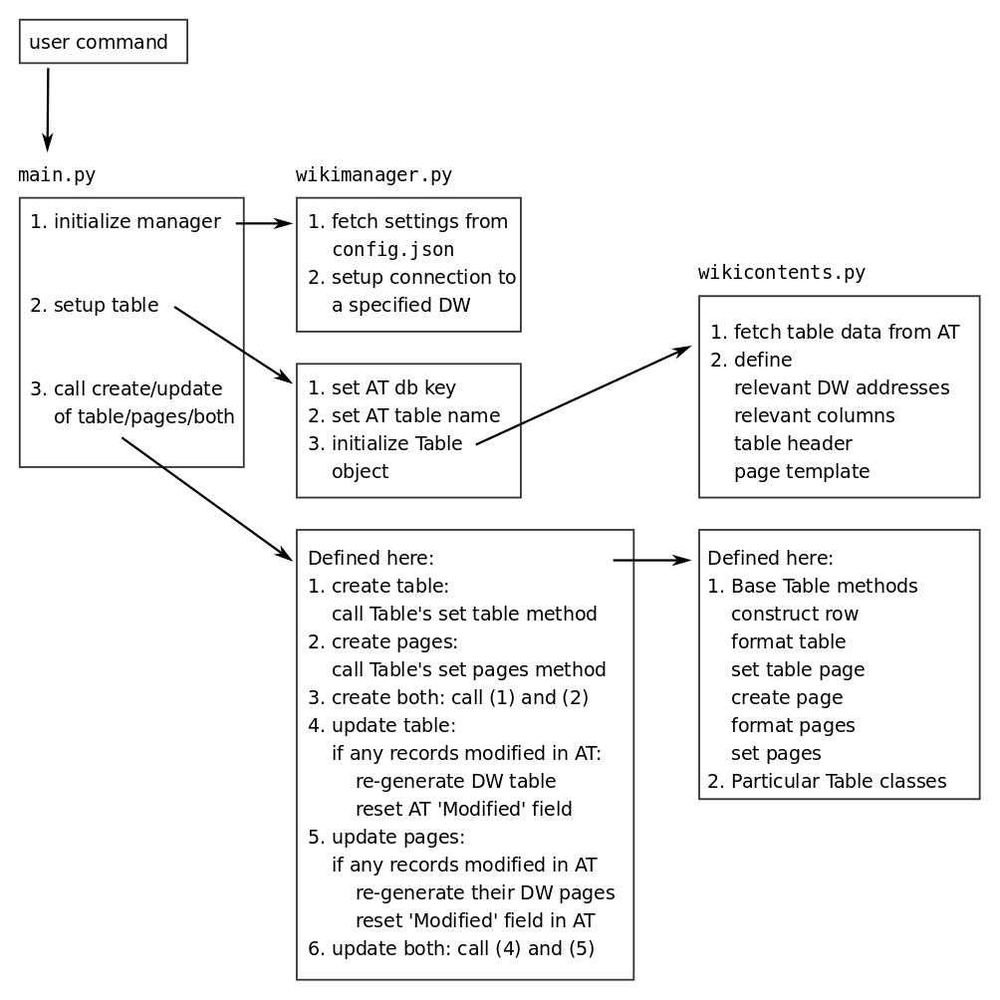

.. Fundraising Innovations Wiki documentation master file, created by
   sphinx-quickstart on Wed Apr 25 10:25:12 2018.
   You can adapt this file completely to your liking, but it should at least
   contain the root `toctree` directive.

***************************
fundingwiki documentation
***************************

.. toctree::
   :maxdepth: 2
   :caption: Contents:

Introduction
=============

The aim of this package is to provide a two-way connection between
Innovations in Fundraising Wiki_ and an Airtable database.
The database stores part of the content that is published on the Wiki: mostly structured content such as evidence for
particular innovation tools and bibliographic references. The package provides a way to access this content in the
database and post it to the Wiki in various formats, i.e. as tables, pages or forms that can be filled in by users that
wish to contribute.

Currently only the database-to-wiki connection is implemented. That is, all the changes to the database-driven content
need to be done inside the database and then pushed to the wiki. In the future we plan to implement a wiki-to-database
connection that would allow content from the wiki to be pushed to the database.

.. _Wiki: http://innovationsinfundraising.org/doku.php

Features
---------

- Create new tables and pages on the wiki based on the database content
- Update existing wiki tables and pages based on changes to the database content

Modules
--------

:py:mod:`main`
:py:mod:`wikimanager`
:py:mod:`wikicontents`

Contribute
-----------

- Issue Tracker: https://github.com/kabramova/fundingwiki/issues
- Source Code: https://github.com/kabramova/fundingwiki

Support
--------

If you are having issues, please let us know in the Issue Tracker.

License
--------

The project is licensed under the BSD license.

Indices and tables
-------------------

* :ref:`genindex`
* :ref:`modindex`
* :ref:`search`

Usage
======

1. Clone the package_ from GitHub to your chosen directory.

2. Make sure you have Python 3 installed and configured to be accessible by default or with a python3 command.

3. Install required dependence packages by running::

    pip3 install -r requirements.txt

4. Configure your user profile file:

    * the script assumes that passwords to the Wiki and the personal Airtable api key are stored in the user bash profile as environmental variables
    * in order to save them as such, open your bash profile file and add the following lines at the bottom::

        export DOKUWIKI_PASS=your_key
        export DOKUWIKI_PASS_TEST=your_key
        export AIRTABLE_API_KEY=your_key

    * your_key for the DOKUWIKI entries are the keys that you use to access the official and test wikis
    * to get your Airtable API key, follow `these instructions <https://support.airtable.com/hc/en-us/articles/219046777-How-do-I-get-my-API-key->`_

5. Configure the settings in ``config.json`` file (located in the package top folder), namely:

    * the package can push content to the official Wiki at ``innovationsinfundraising.org`` or a local version of it (if you have one set up -- instructions on how to do this go beyond the scope of this manual)
    * pushing content requires providing login information to be used to access the Wiki -- ``config.json`` is a dictionary that stores that information
    * **username** is the user login name to access the Wiki
    * **password key** is the key that refers to the key in the user profile file that stores password to access the Wiki; if you followed point 4 above, you do not need to change anything here
    * **wiki url** is the address of the Wiki; you have to change this only if the official Wiki moves or you want to set up your own local version

6. Configure the remote API setting in the Wiki configuration manager:

    * go to Admin --> Configuration Manager --> Authentication --> remoteuser
    * add your user name in the field provided

7. Run main.py with appropriate parameters (see examples below):

    * **wiki version** can be set to 'official' (the one publicly accessible) or 'test' (the local version if set up)
    * **table name** is the name of the table in the Airtable database you want to use (this needs to be exactly the same name as in Airtable, case-sensitive)
    * **mode** can be set to 'create' or 'update' depending on whether you want to create a new resource from scratch or update an existing one
    * **resource type** can be set to 'table', 'pages' or 'both' depending on whether you want to use the Airtable table to build a table, a set of Wiki pages or both

.. _package: https://github.com/kabramova/fundingwiki

The instructions above will set up the environment and allow you to create or update tables and pages based on the content stored in Airtable tables. It will only work, however, for those tables that have been already defined in the package, i.e., for which it has been defined where the content will be published and in what format. It is recommended to first become comfortable with this process before proceeding to the more complex functionalities of the package.

In order to define the format for new tables and publish them on the Wiki, please follow the Development guide.

Examples
---------

Create a Tools table from scratch and push it to the official Wiki
::
    python3 main.py official Tools create table

Update a set of pages that have been previously published on the official Wiki based on the Tools table
::
    python3 main.py official Tools update pages

Create a Papers table and a set of pages and push them to the local test Wiki
::
    python3 main.py test papers_mass create both

Development
============

This package provides a way to connect Airtable (AT) as a GUI database and DokuWiki (DW) as a content presentation system.
This is done through developing interfaces between particular AT tables and particular DW pages. A number of such interfaces
have been implemented and can be kept up to date via the top-level script of this package, i.e., ``main.py``.

Developing a new interface requires several steps described in detail in this section:

1. Understand package structure.
2. Try out default settings for a new table.
3. Define a new table class in ``wikicontents.py``.
4. Define a connection to the new class in ``wikimanager.py``.

Package structure
-----------------

Defaults
-----------------

Defining a new class
-----------------

Adding a connection
-----------------
